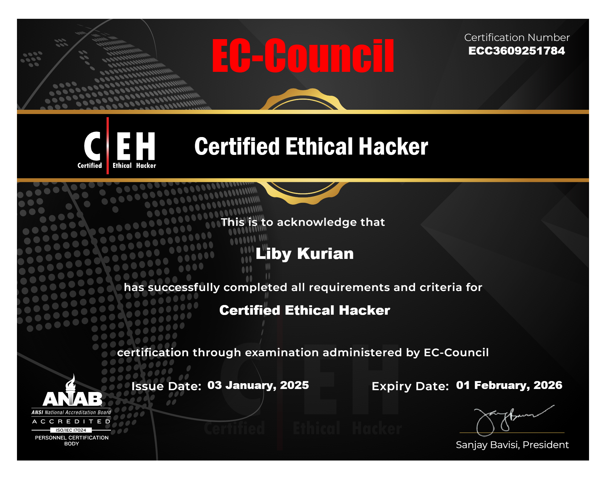

<h1 align="center">🛡️ Cybersecurity Portfolio</h1>

Welcome to my cybersecurity portfolio! Here, I showcase my learnings, course info and certification in the field of cybersecurity. This repository includes projects, certifications, and resources that highlight my expertise and learning.

---
## **[Certified Ethical Hacker (CEH)](https://www.eccouncil.org/train-certify/certified-ethical-hacker-ceh/)**
  
  

- **[Verify via Aspen](https://aspen.eccouncil.org/Verify)**  

---

 ⏬ 🎯 What I've Learned 

Through the **Certified Ethical Hacker (CEH)** program by EC-Council, I have gained hands-on experience in ethical hacking, cybersecurity principles, tools, and methodologies, including:

✅ **Ethical Hacking & Penetration Testing**
- Understanding the ethical hacking lifecycle and penetration testing methodology
- Key steps in conducting penetration tests (reconnaissance, scanning, gaining access, maintaining access, and reporting)

✅ **Footprinting and Reconnaissance**
- Techniques for gathering information about target systems (network and domain information)
- Tools used for footprinting and scanning the target environment

✅ **Network and System Hacking**
- Penetrating wireless networks and securing them
- Hacking operating systems, network protocols, and services
- Cracking password hashes and bypassing authentication mechanisms

✅ **Malware Threats & Analysis**
- Understanding various types of malware (viruses, worms, Trojans)
- Techniques for detecting and mitigating malware threats

✅ **Web Application Hacking**
- Exploiting vulnerabilities in web applications (SQL injection, XSS, CSRF)
- Using tools like Burp Suite and OWASP ZAP to identify vulnerabilities

✅ **Cryptography & Encryption**
- Understanding encryption algorithms (AES, RSA)
- Techniques for encrypting and decrypting data
- Attacking weak encryption algorithms and exploiting weaknesses

✅ **Social Engineering & Phishing Attacks**
- Conducting social engineering attacks (SET, phishing)
- Creating fake websites and emails to trick users into revealing sensitive information

✅ **Evading IDS, Firewalls & Honeypots**
- Techniques for bypassing intrusion detection/prevention systems (IDS/IPS)
- Using tools and techniques to avoid detection by security systems

✅ **Cloud Computing Security**
- Assessing security risks in cloud-based environments
- Understanding security protocols for cloud computing platforms (AWS, Azure, Google Cloud)

 ⏬ 🏆 About the Certified Ethical Hacker (CEH) by EC-Council 

The **Certified Ethical Hacker (CEH)** program by **EC-Council** is a globally recognized certification designed to teach ethical hacking and penetration testing methodologies. This program equips individuals with the skills required to assess the security posture of networks and systems by exploiting vulnerabilities and testing defenses.

### You'll Learn:
- How to ethically hack systems and networks by simulating real-world attacks
- Techniques for identifying vulnerabilities and securing systems
- How to use industry-standard tools and methodologies to assess security

### Syllabus & Topics Covered:
1. **Introduction to Ethical Hacking**
2. **Footprinting and Reconnaissance**
3. **Scanning Networks**
4. **Enumeration**
5. **System Hacking**
6. **Malware Threats**
7. **Sniffing**
8. **Social Engineering**
9. **Denial-of-Service (DoS) Attacks**
10. **Session Hijacking**
11. **Hacking Web Servers**
12. **Hacking Web Applications**
13. **SQL Injection**
14. **Wireless Networks**
15. **Evading IDS, Firewalls, Honeypots**
16. **Cloud Computing Security**
17. **Cryptography**

---

This program includes **200+ hours of practical, hands-on instruction**, providing real-world hacking scenarios to develop the skills needed to become an ethical hacker.

---
## **[Google Cybersecurity Professional Certificate](https://www.coursera.org/professional-certificates/google-cybersecurity)**
  
  

- **[Verify via coursera](https://coursera.org/share/e4371426e5cd37ce9acf7b0a8c22098a)**  
- **[Verify via credly](https://www.credly.com/badges/83d0a879-c1c3-4f22-9b0d-95337c430513/public_url)**
---

  
 ⏬ 🎯 What I've Learned

Through this professional certification program, I have gained hands-on experience in cybersecurity principles, tools, and methodologies, including:

✅ **Understanding Cybersecurity Fundamentals**  
- Importance of cybersecurity practices  
- Cyber threats, risks, and mitigation strategies  

✅ **Security Tools & Techniques**  
- Security Information and Event Management (SIEM)  
- Intrusion Detection Systems (IDS)  
- Linux and SQL for cybersecurity tasks  

✅ **Practical Cybersecurity Applications**  
- Network and endpoint security  
- Cyber incident detection and response  
- Automating cybersecurity tasks with Python  

✅ **Soft Skills for Cybersecurity**  
- Security risk management  
- Communication and collaboration in cybersecurity teams  
- Problem-solving and critical thinking  

 ⏬ 🏆 About the Google Cybersecurity Certificate  

This is an **8-course series** designed by Google to prepare individuals for entry-level cybersecurity roles such as **Cybersecurity Analyst** and **Security Operations Center (SOC) Analyst**.  

### You'll Learn:
- the importance of cybersecurity and its impact on organizations  
- Identify common risks, threats, and vulnerabilities, along with mitigation strategies  
- Protect networks, devices, and data using industry-standard security tools  

### Courses Included:
1. **Foundations of Cybersecurity**  
2. **Play It Safe: Manage Security Risks**  
3. **Connect and Protect: Networks and Network Security**  
4. **Tools of the Trade: Linux and SQL**  
5. **Assets, Threats, and Vulnerabilities**  
6. **Sound the Alarm: Detection and Response**  
7. **Automate Cybersecurity Tasks with Python**  
8. **Put It to Work: Prepare for Cybersecurity Jobs**  

---
This program includes **170+ hours of hands-on instruction**, covering real-world cybersecurity scenarios.

---

## 🚀 Future Plans  

I am continuously learning and working on projects related to cybersecurity, penetration testing, and ethical hacking. Stay tuned for more updates!  

---

🛡️ **Let's connect!** If you have any questions or opportunities, feel free to reach out! 🚀
