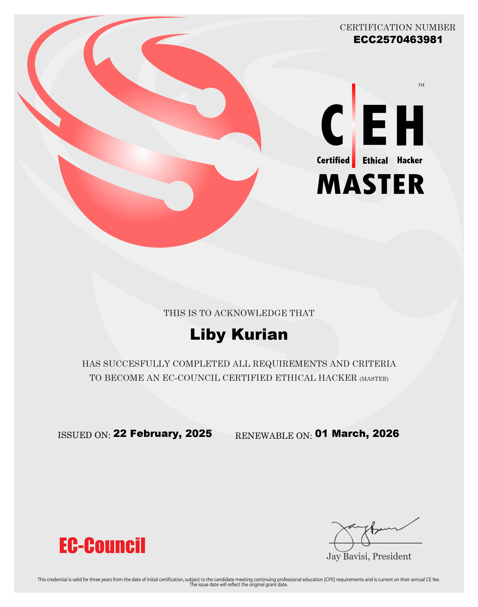
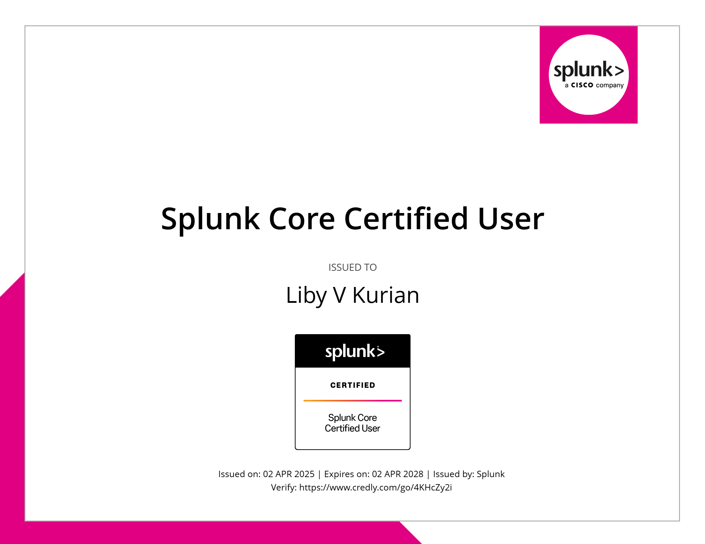

<h1 align="center">🛡️ Cybersecurity Portfolio</h1>

Welcome to my cybersecurity portfolio! Here, I showcase my learnings, course info and certification in the field of cybersecurity. This repository includes projects, certifications, and resources that highlight my expertise and learning.

---
## **[Certified Ethical Hacker (CEH) Master](https://www.eccouncil.org/train-certify/ceh-master/)**
  
  

- **[Verify via Aspen](https://aspen.eccouncil.org/Verify)**  

---

 ⏬ 🎯 What I've Learned 

Through the **Certified Ethical Hacker (CEH)** program by EC-Council, I have gained hands-on experience in ethical hacking, cybersecurity principles, tools, and methodologies, including:

✅ **Ethical Hacking & Penetration Testing**
- Understanding the ethical hacking lifecycle and penetration testing methodology
- Key steps in conducting penetration tests (reconnaissance, scanning, gaining access, maintaining access, and reporting)

✅ **Footprinting and Reconnaissance**
- Techniques for gathering information about target systems (network and domain information)
- Tools used for footprinting and scanning the target environment

✅ **Network and System Hacking**
- Penetrating wireless networks and securing them
- Hacking operating systems, network protocols, and services
- Cracking password hashes and bypassing authentication mechanisms

✅ **Malware Threats & Analysis**
- Understanding various types of malware (viruses, worms, Trojans)
- Techniques for detecting and mitigating malware threats

✅ **Web Application Hacking**
- Exploiting vulnerabilities in web applications (SQL injection, XSS, CSRF)
- Using tools like Burp Suite and OWASP ZAP to identify vulnerabilities

✅ **Cryptography & Encryption**
- Understanding encryption algorithms (AES, RSA)
- Techniques for encrypting and decrypting data
- Attacking weak encryption algorithms and exploiting weaknesses

✅ **Social Engineering & Phishing Attacks**
- Conducting social engineering attacks (SET, phishing)
- Creating fake websites and emails to trick users into revealing sensitive information

✅ **Session Hijacking**
- Exploiting insecure session management to gain unauthorized access
- Session fixation and token manipulation techniques
- Defensive strategies to secure web sessions and prevent hijacking

✅ **Evading IDS, Firewalls & Honeypots**
- Techniques for bypassing intrusion detection/prevention systems (IDS/IPS)
- Using tools and techniques to avoid detection by security systems

✅ **Wireless Hacking**
- Identifying and attacking weak Wi-Fi encryption (WEP, WPA, WPA2)
- Capturing and cracking wireless network traffic using tools like Aircrack-ng
- Rogue access points and Evil Twin attacks

✅ **Cloud Computing Security**
- Assessing security risks in cloud-based environments
- Understanding security protocols for cloud computing platforms (AWS, Azure, Google Cloud)

✅ **IoT and OT Security**
- Understanding vulnerabilities in IoT and Operational Technology (OT) environments
- Securing smart devices and industrial control systems (ICS)
- Exploiting and mitigating weaknesses in IoT networks

 ⏬ 🏆 About the Certified Ethical Hacker (CEH) Master by EC-Council 

The **Certified Ethical Hacker (CEH) Master** by **EC-Council** is an advanced-level certification designed for cybersecurity professionals who want to demonstrate mastery in ethical hacking and penetration testing. It builds upon the foundational CEH certification by requiring candidates to complete a practical exam, proving their ability to perform real-world cyberattacks and defenses in a controlled environment.

### What Makes CEH Master Different?
Unlike CEH, which focuses on theoretical knowledge, CEH Master validates hands-on skills through:  
✔️ CEH Knowledge Exam (Multiple Choice) – Tests theoretical understanding of hacking techniques  
✔️ CEH Practical Exam (6-Hour Challenge) – Requires solving real-world security challenges  

### You'll Learn:
- Advanced hacking techniques and penetration testing methodologies
- Hands-on experience with real-world cyberattacks and exploitations
- How to bypass security defenses and strengthen security postures
- Red teaming and post-exploitation tactics used by ethical hackers

### Syllabus & Topics Covered:
1. **Advanced Reconnaissance & Footprinting**
2. **Deep Network Scanning & Enumeration**
3. **Exploiting Vulnerabilities & Privilege Escalation**
4. **Malware Development & Reverse Engineering Basics**
5. **Packet Sniffing, Spoofing & MITM Attacks**
6. **Advanced Social Engineering Attacks**
7. **Denial-of-Service (DoS) & Distributed DoS (DDoS) Attacks**
8. **Session Hijacking & Web App Exploits**
9. **Database Attacks (SQL Injection, NoSQL Exploits)**
10. **Wireless Network Attacks & Exploit Development**
11. **Evading IDS, Firewalls & Security Controls**
12. **Cloud Security Exploitation & Hardening**
13. **Cryptography Attacks & Steganography**
14. **Red Teaming & Active Directory Attacks**
15. **IoT & OT Security Vulnerabilities**

---

This program provides real-world hacking labs, 200+ hands-on exercises, and a final practical challenge that mimics actual cyber threats faced by enterprises.  

🏆 Passing the CEH Practical Exam earns you the prestigious CEH Master credential!

📌 Note: If you want to check out my detailed notes for your preparation, [here’s the link](https://github.com/LibyKurian/ethicalhacking-h.git)

---
## **[Splunk Core Certified User](https://www.splunk.com/en_us/training/certification-track/splunk-core-certified-user.html)**
  
  
 
- **[Verify via credly](https://www.credly.com/badges/3b710c09-1298-4d48-a788-25b33ec2271a)**
---

  
 ⏬ 🎯 What I've Learned

Through the **Splunk Core Certified User** program, I have gained foundational knowledge and hands-on experience in navigating and utilizing Splunk for data analysis and security monitoring:

✅ **Core Splunk Knowledge**  
- Understanding Splunk's architecture and key components  
- Navigating the Splunk interface and using basic search commands  

✅ **Search & Reporting**  
- Performing searches using SPL (Search Processing Language)  
- Filtering and transforming data for insights  
- Creating and scheduling reports for recurring insights  

✅ **Dashboards & Visualizations**  
- Designing and editing dashboards  
- Using panels and visualizations for real-time data monitoring  
- Modifying chart types and panel positioning  

✅ **Alerts & Lookups**  
- Setting up alerts based on search conditions  
- Using lookups to enrich search results with external data  
- Managing permissions for shared reports and dashboards  

 ⏬ 🏆 About the Splunk Core Certified User Certification 

The **Splunk Core Certified User** certification validates a user’s ability to search, use fields, create alerts, and build reports and dashboards in **Splunk Enterprise** or **Splunk Cloud** platforms.  

### You'll Learn:
- How to search and filter data using SPL  
- Create and schedule alerts based on specified conditions  
- Build dashboards and use lookups to enrich data  
- Understand the fundamentals of Splunk's data ingestion and analysis  

### Key Areas Covered:
1. **Splunk Interface Navigation**  
2. **Search Language (SPL) Basics**  
3. **Fields and Lookups**  
4. **Reports and Alerts**  
5. **Dashboards and Visualizations**  

---
This entry-level certification is ideal for anyone looking to begin their journey with Splunk and gain a solid foundation in data analysis and security monitoring.

📌 Note: If you want to check out my detailed notes for your preparation, [here’s the link](https://github.com/LibyKurian/Splunkcoreuser-h.git)

---
## **[Google Cybersecurity Professional Certificate](https://www.coursera.org/professional-certificates/google-cybersecurity)**
  
  

- **[Verify via coursera](https://coursera.org/share/e4371426e5cd37ce9acf7b0a8c22098a)**  
- **[Verify via credly](https://www.credly.com/badges/83d0a879-c1c3-4f22-9b0d-95337c430513/public_url)**
---

  
 ⏬ 🎯 What I've Learned

Through this professional certification program, I have gained hands-on experience in cybersecurity principles, tools, and methodologies, including:

✅ **Understanding Cybersecurity Fundamentals**  
- Importance of cybersecurity practices  
- Cyber threats, risks, and mitigation strategies  

✅ **Security Tools & Techniques**  
- Security Information and Event Management (SIEM)  
- Intrusion Detection Systems (IDS)  
- Linux and SQL for cybersecurity tasks  

✅ **Practical Cybersecurity Applications**  
- Network and endpoint security  
- Cyber incident detection and response  
- Automating cybersecurity tasks with Python  

✅ **Soft Skills for Cybersecurity**  
- Security risk management  
- Communication and collaboration in cybersecurity teams  
- Problem-solving and critical thinking  

 ⏬ 🏆 About the Google Cybersecurity Certificate  

This is an **8-course series** designed by Google to prepare individuals for entry-level cybersecurity roles such as **Cybersecurity Analyst** and **Security Operations Center (SOC) Analyst**.  

### You'll Learn:
- the importance of cybersecurity and its impact on organizations  
- Identify common risks, threats, and vulnerabilities, along with mitigation strategies  
- Protect networks, devices, and data using industry-standard security tools  

### Courses Included:
1. **Foundations of Cybersecurity**  
2. **Play It Safe: Manage Security Risks**  
3. **Connect and Protect: Networks and Network Security**  
4. **Tools of the Trade: Linux and SQL**  
5. **Assets, Threats, and Vulnerabilities**  
6. **Sound the Alarm: Detection and Response**  
7. **Automate Cybersecurity Tasks with Python**  
8. **Put It to Work: Prepare for Cybersecurity Jobs**  

---
This program includes **170+ hours of hands-on instruction**, covering real-world cybersecurity scenarios.

📌 Note: If you're looking for notes from this certification course, check out the rest of the pages in this same repository!

---

## 🚀 Future Plans  

I am continuously learning and working on projects related to cybersecurity, penetration testing, and ethical hacking. Stay tuned for more updates!  

---

🛡️ **Let's connect!** If you have any questions or opportunities, feel free to reach out! 🚀
