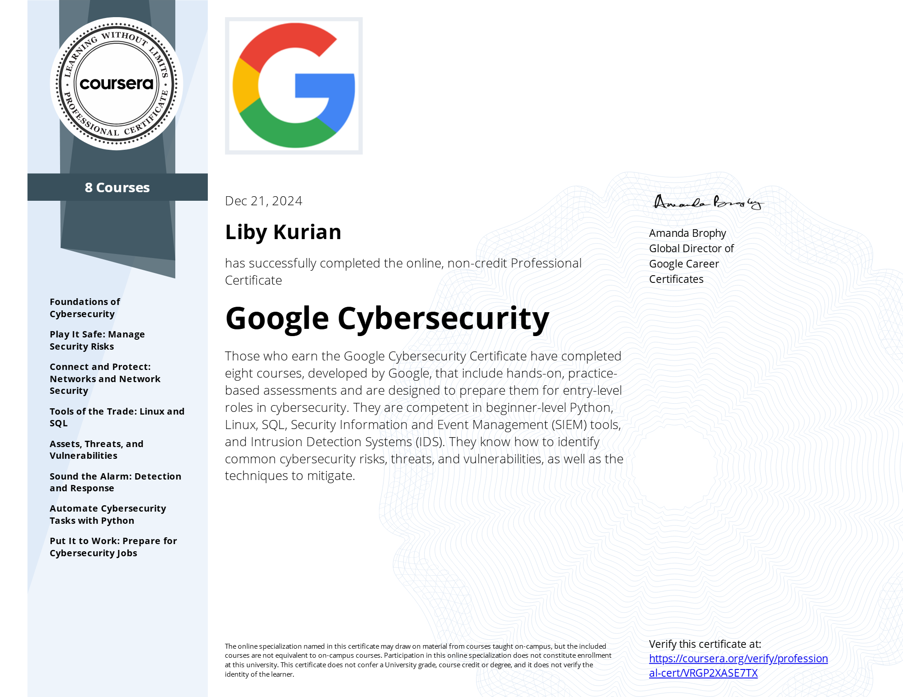

# 🛡️ Cybersecurity Portfolio

Welcome to my cybersecurity portfolio! Here, I showcase my learnings, course info and certification in the field of cybersecurity. This repository includes projects, certifications, and resources that highlight my expertise and learning.

---
- **[Google Cybersecurity Professional Certificate](https://www.coursera.org/professional-certificates/google-cybersecurity)**
  
  

- **[Verify via coursera](https://coursera.org/share/e4371426e5cd37ce9acf7b0a8c22098a)**  
- **[Verify via credly](https://www.credly.com/badges/83d0a879-c1c3-4f22-9b0d-95337c430513/public_url)**
---

## 🎯 What I've Learned  

Through this professional certification program, I have gained hands-on experience in cybersecurity principles, tools, and methodologies, including:  

✅ **Understanding Cybersecurity Fundamentals**  
- Importance of cybersecurity practices  
- Cyber threats, risks, and mitigation strategies  

✅ **Security Tools & Techniques**  
- Security Information and Event Management (SIEM)  
- Intrusion Detection Systems (IDS)  
- Linux and SQL for cybersecurity tasks  

✅ **Practical Cybersecurity Applications**  
- Network and endpoint security  
- Cyber incident detection and response  
- Automating cybersecurity tasks with Python  

✅ **Soft Skills for Cybersecurity**  
- Security risk management  
- Communication and collaboration in cybersecurity teams  
- Problem-solving and critical thinking  

---

## 🏆 About the Google Cybersecurity Certificate  

This is an **8-course series** designed by Google to prepare individuals for entry-level cybersecurity roles such as **Cybersecurity Analyst** and **Security Operations Center (SOC) Analyst**.  

### You'll Learn:
- the importance of cybersecurity and its impact on organizations  
- Identify common risks, threats, and vulnerabilities, along with mitigation strategies  
- Protect networks, devices, and data using industry-standard security tools  

### Courses Included:
1. **Foundations of Cybersecurity**  
2. **Play It Safe: Manage Security Risks**  
3. **Connect and Protect: Networks and Network Security**  
4. **Tools of the Trade: Linux and SQL**  
5. **Assets, Threats, and Vulnerabilities**  
6. **Sound the Alarm: Detection and Response**  
7. **Automate Cybersecurity Tasks with Python**  
8. **Put It to Work: Prepare for Cybersecurity Jobs**  

This program includes **170+ hours of hands-on instruction**, covering real-world cybersecurity scenarios.

---

## 🚀 Future Plans  

I am continuously learning and working on projects related to cybersecurity, penetration testing, and ethical hacking. Stay tuned for more updates!  

---

🛡️ **Let's connect!** If you have any questions or opportunities, feel free to reach out! 🚀
